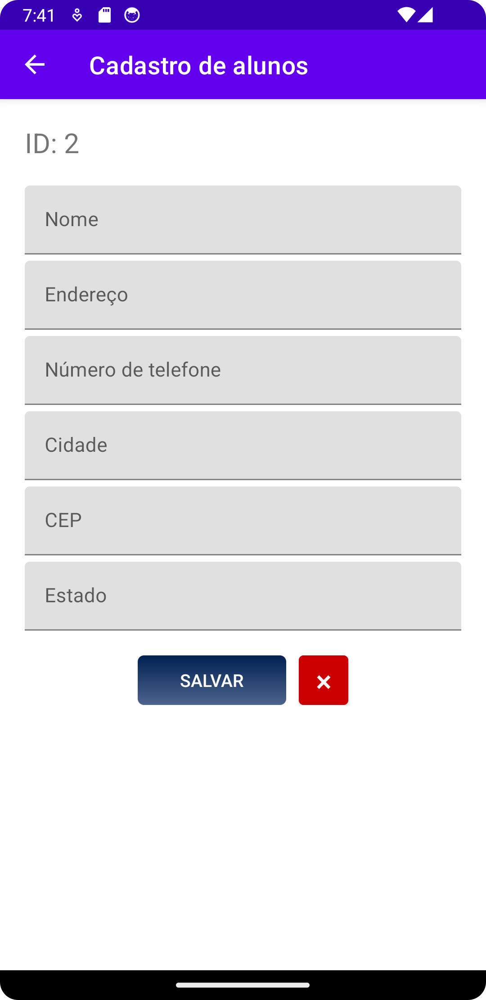
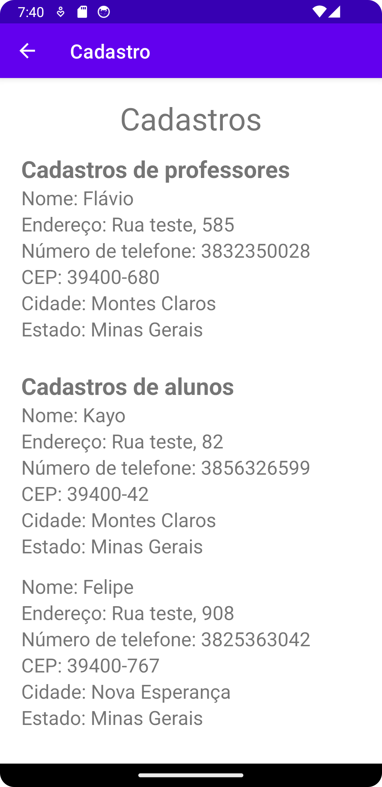

<h1 align="center">Cadastro de alunos e professores</h1>

### Descrição
Este aplicativo foi desenvolvido como parte dos requisitos parciais para a disciplina de Projeto Integrador I do Instituto Federal do Norte de Minas Gerais (IFNMG), e tem como foco o cadastro de usuários e professores. Ele foi implementado em Java para a plataforma Android, e contém uma interface simples e acessível para cadastrar usuários e visualizá-los.

O aplicativo armazena os dados de cadastros utilizando a API Shared Preferences do Android, ou seja, os dados são guardados na memória interna do celular, e não serão apagados após o fechamento do aplicativo.

### Capturas de tela

### Licença

[ISC](LICENSE.md) © 2024 Kayo Souza
